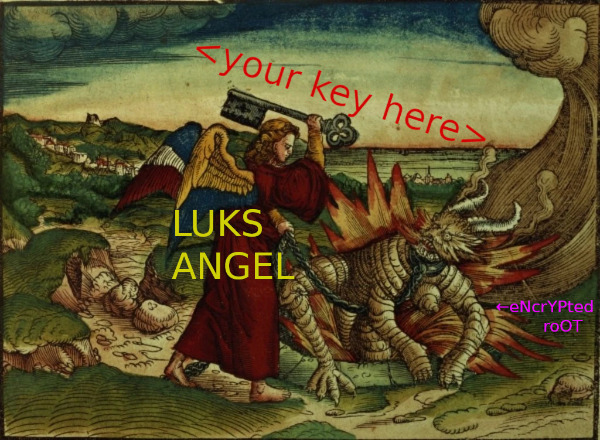

# luks-angel
* Unlocks your LUKS cryptroot automatically
* Scans all attached USB keys for LUKS keys
* Smites daemons from the bottomless pit at the [coming of the end-times](https://www.kingjamesbibleonline.org/Revelation-9-1/)
* Provision new USB keys and add them to existing LUKS cryptroots

